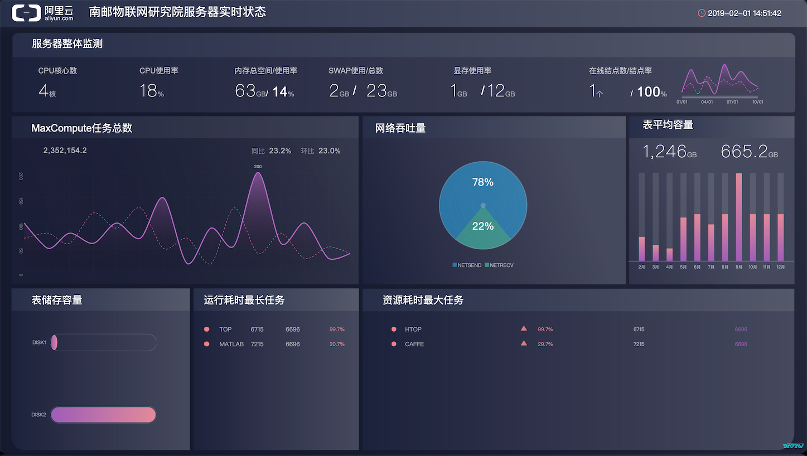
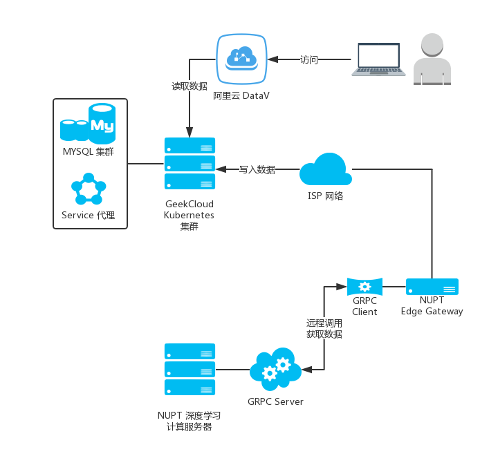

# Pylib
pylib是一个用python编写的用于获取传感器芯片、硬件、服务、操作系统信息的库。
目前涵盖的库有：
- 物联网芯片AT指令库与数据通信库
- 硬件信息查询库
- 系统信息查询库
- MYSQL 驱动库

### 芯片功能库 
- GPS
- GPRS
- SMS

### 案例

- 阿里云 DATAV NUPT 服务器监控仪表盘

#### 系统架构

### 更新日志

- 2018-11-8: 发布 GPS、GPRS、SMS 模块库,修复 Bug

- 2018-12-24: 增加sys系统库、MYSQL驱动库,修复 Bug
